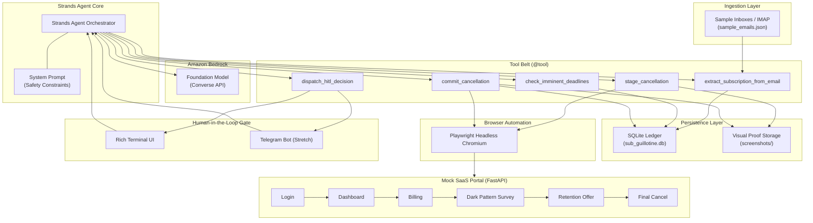

# Sub Guillotine -- Autonomous Financial Defense Agent

> **"Hunt recurring SaaS subscriptions, navigate dark-pattern cancellation mazes, and save money with Agent-in-the-Loop safety."**

---

## Overview & Problem Statement

Every year, consumers and businesses lose billions of dollars to **unwanted recurring subscriptions**, **forgotten free trials**, and **deliberately weaponized cancellation dark patterns** (multi-step exit surveys, hidden billing buttons, fake loading spinners, and manipulative retention discount traps).

**Sub Guillotine** is an autonomous AI agent powered by **Amazon Bedrock** and **Playwright browser automation**. It audits incoming email billing notices, tracks imminent renewal deadlines, autonomously navigates dark pattern cancellation flows up to the final gate, and presents visual proof to the user for one-click authorization.

---

## System Architecture



---

## The 5-Phase Guillotine Execution Pipeline

1. **Phase 1: SCAN (Email Ingestion & LLM Parsing)**
   - Ingests raw emails (HTML/Plaintext) and uses Amazon Bedrock to extract structured metadata (`service_name`, `amount`, `currency`, `billing_cycle`, `renewal_date`, `cancellation_url`).
2. **Phase 2: DETECT (Deadline Auditing)**
   - Audits the SQLite ledger and detects upcoming renewals within the user's warning threshold (e.g. within 24 hours).
3. **Phase 3: STAGE (Dark Pattern Navigation)**
   - Launches headless Chromium via Playwright, navigates through login forms, billing screens, cancellation surveys, and discount popups, halting safely right before the destructive confirmation click.
   - Captures a **pre-cancellation screenshot**.
4. **Phase 4: ASK (Human-in-the-Loop Safety Gate)**
   - Renders a Rich CLI decision card with service cost, countdown urgency, and screenshot link.
   - Requires explicit human authorization (`CANCEL` vs `KEEP`).
5. **Phase 5: EXECUTE OR STAND DOWN**
   - **CANCEL:** Agent clicks confirmation, captures timestamped proof screenshot, updates status to `CANCELLED`, and logs money saved.
   - **KEEP:** Agent stands down immediately and marks subscription as `KEPT`.

---

## Quick Start & Installation

### 1. Clone & Setup Environment

```bash
# Clone the repository
git clone https://github.com/ShreyashChaurasia/sub-guillotine.git
cd sub-guillotine

# Create and activate Python virtual environment
python3 -m venv .venv
source .venv/bin/activate

# Install dependencies
pip install -r requirements.txt

# Install Playwright browser
playwright install
```

### 2. Configure AWS & Environment

Copy `.env.example` to `.env` and configure your Amazon Bedrock credentials:

```bash
cp .env.example .env
```

Edit `.env`:

```env
AWS_ACCESS_KEY_ID=your_access_key
AWS_SECRET_ACCESS_KEY=your_secret_key
AWS_DEFAULT_REGION=us-east-1
BEDROCK_MODEL_ID=amazon.nova-pro-v1:0
```

---

## Running the Application

### Automated End-to-End Demo

Runs the complete 5-phase pipeline against sample emails and the mock SaaS portal:

```bash
python -m src.main --demo
```

### Interactive Mode (Prompt for Human Authorization)

```bash
python -m src.main
```

### Check Subscription Ledger & Total Savings

```bash
python -m src.main --status
```

### Start Mock SaaS Portal Standalone (Port 8888)

```bash
python -m src.main --start-portal
```

*Visit `http://localhost:8888` in your browser to experience the dark-pattern cancellation flow.*

---

## Testing

Run the comprehensive unit and end-to-end integration test suite:

```bash
pytest tests/ -v
```

---

## Financial Safety & Ethics

Sub Guillotine is built from the ground up with **Agent-in-the-Loop (AIL) guardrails**:

- **Zero Autonomous Financial Mutation:** The agent is architecturally blocked from clicking final cancellation buttons without explicit operator input.
- **Auditable Visual Trail:** Every staging and execution step generates timestamped screenshots in `screenshots/`.
- **Local Ledger:** All subscription tracking and state history resides in a local SQLite database (`sub_guillotine.db`).

---

## License

This project is licensed under the [MIT License](LICENSE).
